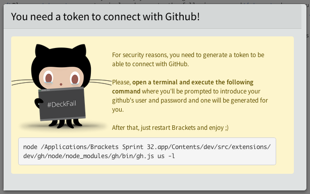
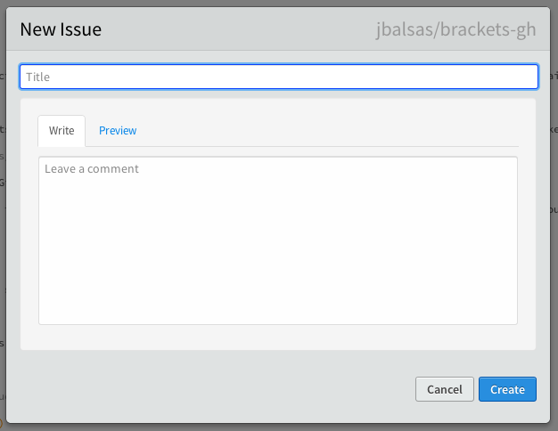
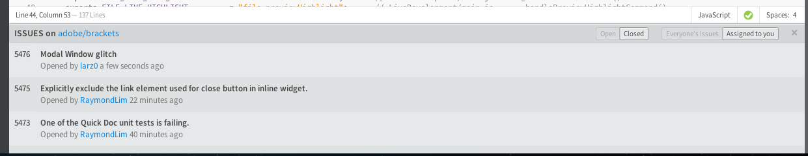
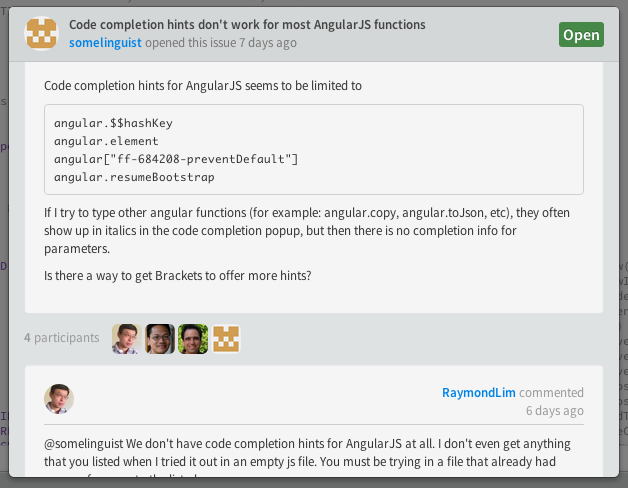

# BracketsGH

A Github extension for [Brackets](http://brackets.io/) powered by [NodeGH](http://nodegh.io/)

> Brackets ❤ NodeGH ❤ GitHub

## Table of contents

* [Install](#install)
    * [Extension](#extension)
    * [Github Token](#github-token)
* [Usage](#usage)
    * [Issues](#issues)

## Install

### Extension

BracketsGH is available directly from the [Brackets Registry](https://brackets-registry.aboutweb.com/). For more detailed instructions, check out the [Brackets Extensions wiki page](https://github.com/adobe/brackets/wiki/Brackets-Extensions)

### Github Token

For security reasons, BracketsGH needs a GitHub token to work. To generate it, you need to go to the path where Brackets extensions are installed and execute

    node gh/node/node_modules/gh/bin/gh.js us -l

You'll be prompted for your GitHub username and password, and a token will be generated for you.

In case you don't know where the folder is, just click on `GitHub > Generate GitHub Token` and BracketsGH will provide you with the appropiated command specific to your current installation.

## Usage

BracketsGH is context-aware, so you just need to open your project and he'll do the rest.

### Issues

Most Issue related operations are already available

#### 1. Create

Go to `GitHub > New Issue` or press `Cmd/Ctrl + Shift + N` to quickly create a new issue.

#### 2. List

Go to `GitHub > Explore Issues` to load the issues of the current project.

#### 3. View / Comment / Close / Reopen

Click on an issue on the issues list to open the conversation view where you can close or reopen it, comment and read all the history.

